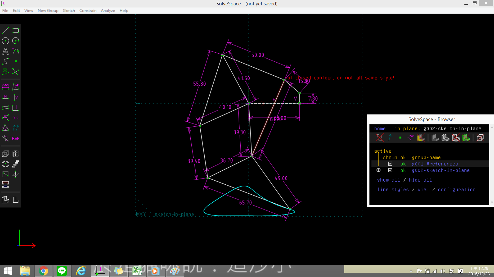
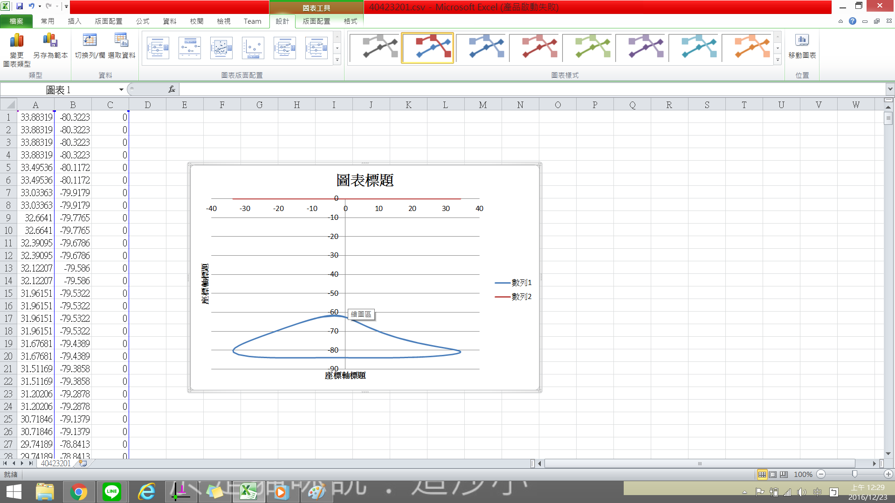

Title: w15 四連桿與多連桿運動模擬:
Date: 2016-12-30 12:00
Category: Misc
Tags: 上課內容, OnShape, SolveSpace
Author: 40423201

<!-- PELICAN_END_SUMMARY -->

四連桿與多連桿運動模擬:

<iframe src="https://player.vimeo.com/video/196751677" width="640" height="340" frameborder="0" webkitallowfullscreen mozallowfullscreen allowfullscreen></iframe>

<a href="https://vimeo.com/196751677">bandicam 2016-12-23 00-21-33-425</a> from <a href="https://vimeo.com/user45597735">40423201</a> on <a href="https://vimeo.com">Vimeo</a>.

將所得到的點座標 .csv 以 Excel 畫圖, 得到:
  

